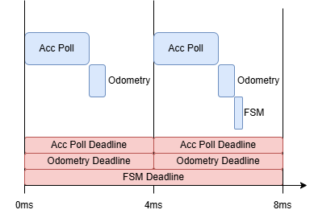
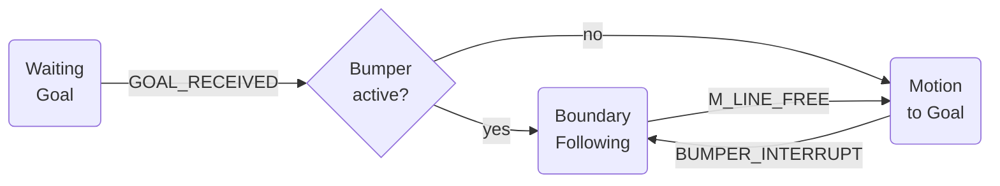

# Final Project — Real-Time Systems
Implementation of the Bug 1 Algorithm with Position Estimation Using an Accelerometer
Project Description

This project implements a real-time embedded navigation system based on the classical Bug 1 algorithm. The goal is to guide a mobile robot from a starting point to a target location while avoiding obstacles detected locally.

As part of the Real-Time Systems course requirements, the system integrates several concepts covered in class, including:

- Periodic and sporadic tasks
- Deadlines and priority assignments
- Inter-task communication
- Timing and scheduling constraints
- Real-time sensor acquisition

The robot uses an onboard accelerometer (such as the MPU6050) to generate a coarse estimate of its position through numerical integration. This estimate is not intended to replace proper odometry but serves to demonstrate the use of inertial sensors in a real-time context.

# Task Specifications

## Task T1: Accelerometer Polling
- Type: Periodic
- Period (P): 6ms
- Cost (C): 1ms
- Deadline (D): 6ms (hard)

## Task T2: Odometry Calculation
- Type: Periodic
- Period (P): 6ms
- Cost (C): 3
- Deadline (D): 6ms (hard)

## Task T3: Finite State Machine for Bug1 Algorithm
- Type: Periodic
- Period (P): 12ms
- Cost (C): 1
- Deadline (D): 12ms (hard)

## Task T4: Bumpers Interrupt Handle
- Type: Sporadic
- Min Interval (min/P): 1000ms
- Cost (C): 5
- Deadline (D): 10ms (soft)

# Task Schedulling

| Task | Type      | Period (P) / Min Interval | Cost (C) | Deadline (D) | Notes |
|------|-----------|---------------------------|----------|--------------|-------|
| **T1: Accelerometer Polling** | Periodic | 6 ms | 1 ms | 6 ms (hard) | — |
| **T2: Odometry Calculation**  | Periodic | 6 ms | 3 ms | 6 ms (hard)  | — |
| **T3: FSM Bug1 Algorithm**    | Periodic | 12 ms | 1 ms | 12 ms (hard) | — |
| **T4: Bumper Interrupt**      | Sporadic | 100 ms (min) | ? ms | 10ms (soft) | Interrupt-driven |

## Scheduling

- Major Cycle: 12ms
- Minor Cycle: 6ms

# Finite State Machine for Bug 1 Algorithm (T4) description

